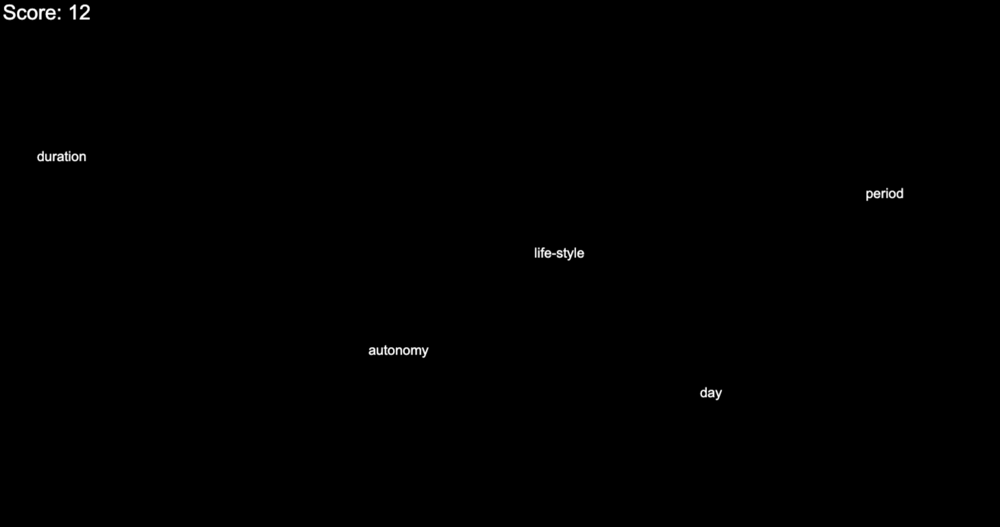

# Type Racer V1

Type Racer V1 is an engaging and interactive browser-based game where users race against time by typing words as they appear on the screen. Words dynamically move from left to right, and players must type them correctly before they reach the edge of the screen. Words are dynamically fetched using the [Datamuse API](https://www.datamuse.com/api/)



---

## 🎮 How to Play

1. Open the game in your browser.
2. Press the **Spacebar** to start the game.
3. Type the words as they appear on the screen.
4. Earn points for each correctly typed word. The game ends if a word reaches the right edge of the screen.
5. Check your highest score and try to beat it!

---

## 🌐 Live Demo

Play the game live: [Typing Race Game](https://aliemrepmk.github.io/TypeRacer-V1/)

---

## 🛠️ Setup Instructions

Follow these steps to set up and run the project locally:

### Prerequisites
- A modern web browser (e.g., Chrome, Firefox, Edge).

### Steps
1. Clone the repository to your local machine:
   ```bash
   git clone https://github.com/aliemrepmk/TypeRacer-V1.git
   cd your-repo-name
   ```

2. Open the project folder and locate the `index.html` file.

3. Open `index.html` in your preferred browser to play the game.

### Alternative (Run with Live Server)
If you use **VS Code**, you can run the project using the **Live Server** extension:
1. Install the Live Server extension in VS Code.
2. Open the project folder in VS Code.
3. Right-click on `index.html` and select **"Open with Live Server"**.

---

## 📋 Features to implement

- [x] Implement core gameplay mechanics.
- [x] Add scoring system.
- [x] Fetch the words using API.
- [x] Add colorization to words.
- [ ] Add jittering effect to words.
- [ ] Add mobile support for touch-based controls.
- [ ] Improve performance (optimization).

---